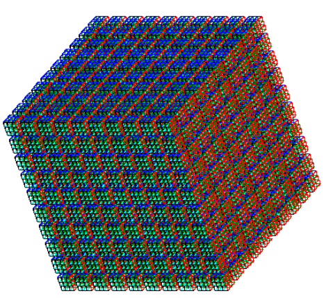
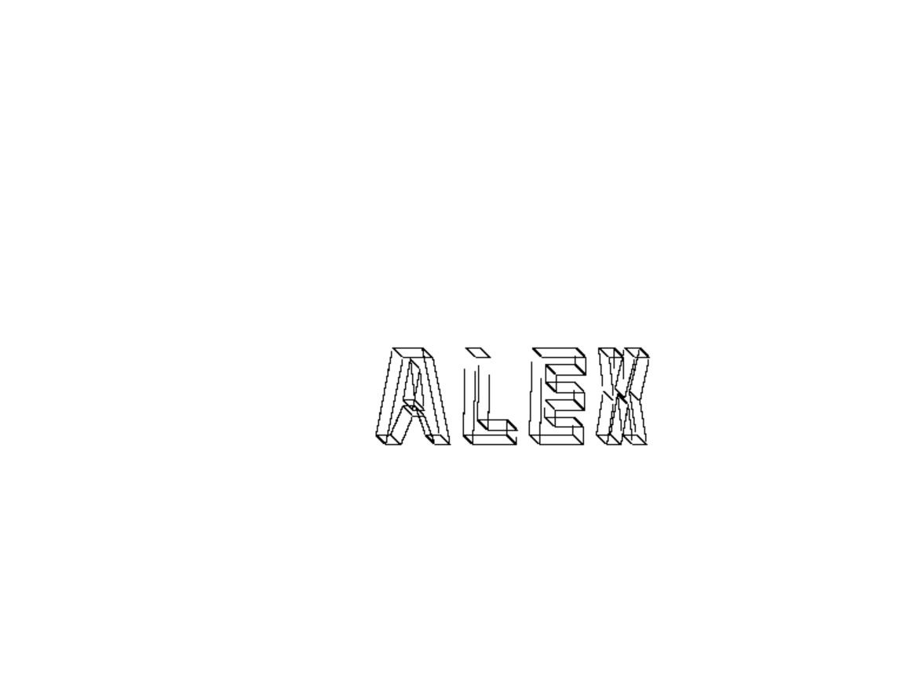
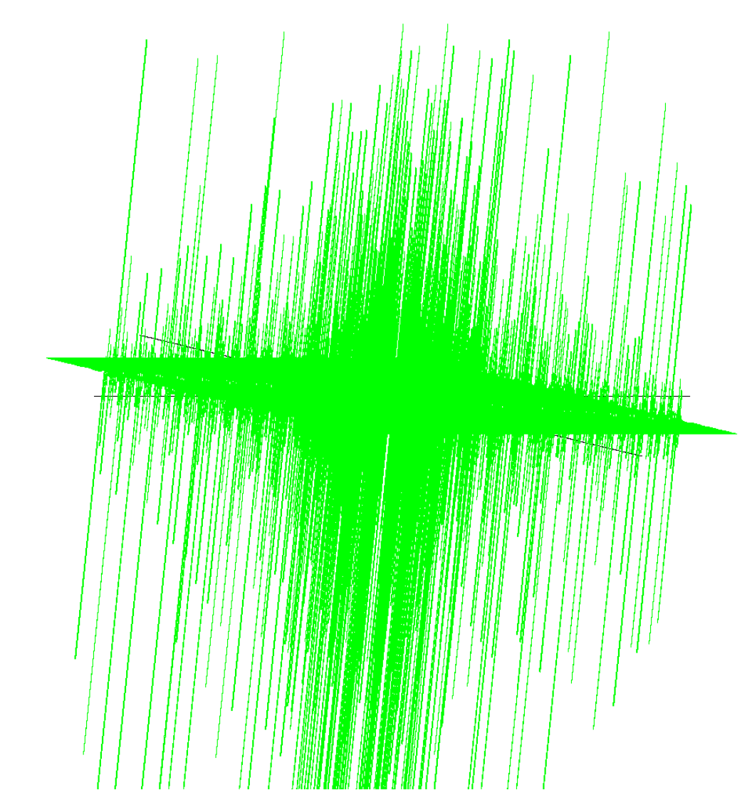
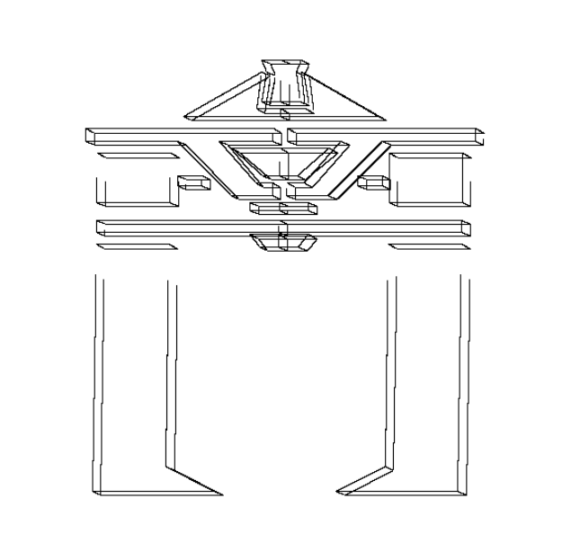
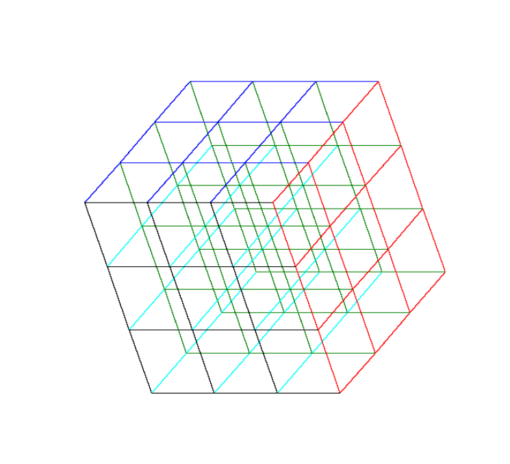
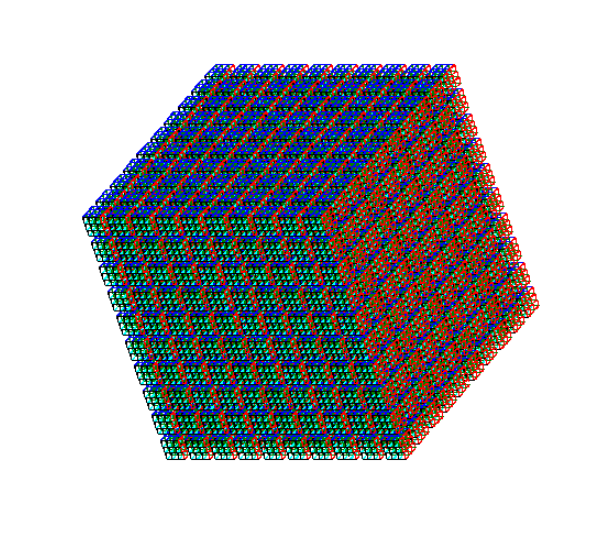

<div id="top"></div>
<!--
*** Thanks for checking out the Best-README-Template. If you have a suggestion
*** that would make this better, please fork the repo and create a pull request
*** or simply open an issue with the tag "enhancement".
*** Don't forget to give the project a star!
*** Thanks again! Now go create something AMAZING! :D
-->


<!-- PROJECT SHIELDS -->
<!--
*** I'm using markdown "reference style" links for readability.
*** Reference links are enclosed in brackets [ ] instead of parentheses ( ).
*** See the bottom of this document for the declaration of the reference variables
*** for contributors-url, forks-url, etc. This is an optional, concise syntax you may use.
*** https://www.markdownguide.org/basic-syntax/#reference-style-links
-->
[![LinkedIn][linkedin-shield]][linkedin-url]


<!-- PROJECT LOGO -->
<br />
<div align="center">
  <a href="https://github.com/alexpena5635/CS324/tree/main/assign3">
    
  </a>

<h3 align="center">2D/3D Wireframe Graphics System</h3>

  <p align="center">
    3D/2D graphics system capable of plotting and wireframe modeling. Lines and points stored in a vector of pixels (a canvas), then output in .pbm format for viewing. Developed throughout a computer graphics class in multiple phases using C and C++.
    <br />
    <br />
  </p>
</div>

<br>

<a href="#generated-images">Generated Images</a>

<!-- IMAGES -->
<!-- <h3>Generated Images</h3>
<details>
      <summary>Block Letters</summary>
      <ol>
          
      </ol>
    </details>
    <details>
      <summary>3D Plot</summary>
      <ol>
        
      </ol>
    </details>
    <details>
      <summary>Tron Recognizer</summary>
      <ol>
        
      </ol>
    </details>
    <details>
      <summary>Simple Rubix Cube</summary>
      <ol>
        
      </ol>
    </details>
    <details>
      <summary>Rubix Cube with Gaps</summary>
      <ol>
        
      </ol>
    </details>
    <details>
      <summary>Rubix Grid</summary>
      <ol>
        
      </ol>
    </details>

<br><br> -->

<!-- ABOUT THE PROJECT -->
## About The Project

Here's a blank template to get started: To avoid retyping too much info. Do a search and replace with your text editor for the following: `github_username`, `repo_name`, `twitter_handle`, `linkedin_username`, `email_client`, `email`, `project_title`, `project_description`

<p align="right">(<a href="#top">back to top</a>)</p>


### Built With

[![Vue][Vue.js]][Vue-url]

<p align="right">(<a href="#top">back to top</a>)</p>


<!-- GETTING STARTED -->
## Getting Started

This is an example of how you may give instructions on setting up your project locally.
To get a local copy up and running follow these simple example steps.

### Prerequisites

This is an example of how to list things you need to use the software and how to install them.
* npm
  ```sh
  npm install npm@latest -g
  ```

### Installation

1. Get a free API Key at [https://example.com](https://example.com)
2. Clone the repo
   ```sh
   git clone https://github.com/github_username/repo_name.git
   ```
3. Install NPM packages
   ```sh
   npm install
   ```
4. Enter your API in `config.js`
   ```js
   const API_KEY = 'ENTER YOUR API';
   ```

<p align="right">(<a href="#top">back to top</a>)</p>


<!-- USAGE EXAMPLES -->
## Usage

Use this space to show useful examples of how a project can be used. Additional screenshots, code examples and demos work well in this space. You may also link to more resources.

_For more examples, please refer to the [Documentation](https://example.com)_

<p align="right">(<a href="#top">back to top</a>)</p>


<!-- CONTACT -->
## Contact

Your Name - [@twitter_handle](https://twitter.com/twitter_handle) - email@email_client.com

Project Link: [https://github.com/github_username/repo_name](https://github.com/github_username/repo_name)

<p align="right">(<a href="#top">back to top</a>)</p>


<!-- ACKNOWLEDGMENTS -->
## Acknowledgments

* []()
* []()
* []()

<p align="right">(<a href="#top">back to top</a>)</p>

## Generated Images
<p align="right">(<a href="#top">back to top</a>)</p><br>
  <summary>Block Letters</summary>
    

  <summary>3D Plot</summary>
    

  <summary>Tron Recognizer</summary>
    

  <summary>Simple Rubix Cube</summary>
    

  <summary>Rubix Cube with Gaps</summary>
    

  <summary>Rubix Grid</summary>
    
    

<!-- MARKDOWN LINKS & IMAGES -->
<!-- https://www.markdownguide.org/basic-syntax/#reference-style-links -->
[linkedin-shield]: https://img.shields.io/badge/-LinkedIn-black.svg?style=for-the-badge&logo=linkedin&colorB=555
[linkedin-url]: https://www.linkedin.com/in/alex-peña-944095241 
